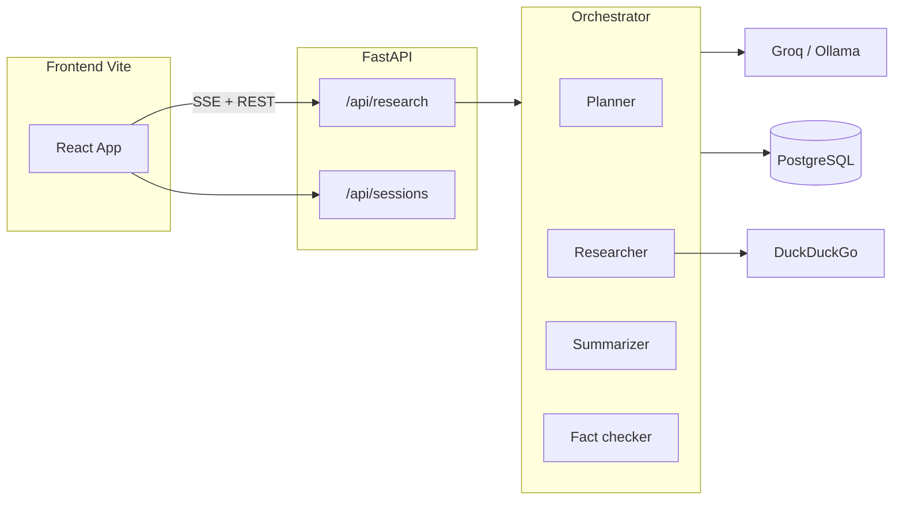

# Multi-Agent Research Assistant

A full-stack application that turns a natural-language research question into a **structured report**: sub-questions, web sources with extracted text, a **markdown summary** with inline citations (`[S1-1]`, `(s1-1)`), and **LLM-generated fact checks**. Sessions are **persisted in PostgreSQL** and shareable via URL.

---

## Table of contents

1. [Features](#features)  
2. [Architecture](#architecture)  
3. [Tech stack](#tech-stack)  
4. [Prerequisites](#prerequisites)  
5. [Quick start (local)](#quick-start-local)  
6. [Run with Docker](#run-with-docker)  
7. [Configuration](#configuration)  
8. [API reference](#api-reference)  
9. [Research pipeline](#research-pipeline)  
10. [Frontend](#frontend)  
11. [Testing](#testing)  
12. [Project layout](#project-layout)  
13. [Troubleshooting](#troubleshooting)  
14. [License](#license)

---

## Features

- **Planner** — Decomposes the user query into sub-questions or asks for clarification when needed.  
- **Researcher** — Search (DuckDuckGo via `ddgs`), fetch pages, extract readable text (`trafilatura` / BeautifulSoup).  
- **Summarizer** — Produces markdown with **strict source IDs** in citations; optional repair pass if citations are invalid.  
- **Fact checker** — Emits structured claims with `supported` / `unsupported` / `uncertain` and evidence source IDs.  
- **Persistence** — Sessions, agent steps, sources, and fact checks stored in Postgres; reload via `/sessions/:id`.  
- **Streaming UI** — `EventSource` SSE for live progress and final payload.  
- **Web UI** — React + Vite + Tailwind; markdown rendering, TOC, quality heuristics, collapsible sources/fact checks, sheets for source detail and mobile history, Sonner toasts.

---

## Architecture



High level: the **orchestrator** runs agents in order, persists intermediate outputs, emits **SSE progress** events, and returns a **ResearchResponse** (or streams it on the SSE `final` event).

---

## Tech stack

| Layer | Technology |
|--------|------------|
| API | Python 3, FastAPI, Uvicorn, Pydantic v2 |
| DB | PostgreSQL, SQLAlchemy 2 async, Alembic, asyncpg |
| LLM | Groq (OpenAI-compatible) and/or Ollama |
| Search | DuckDuckGo (`ddgs`) |
| Extraction | httpx, trafilatura, BeautifulSoup |
| UI | React 18, TypeScript, Vite 5, React Router 7 |
| UI kit | Radix primitives, Tailwind CSS, Sonner, Lucide |

---

## Prerequisites

- **Python 3.11+** (3.10+ may work; project is tested with async SQLAlchemy patterns).  
- **Node.js 18+** and npm.  
- **PostgreSQL** reachable from the machine running the API (or use **Docker Compose**, which runs Postgres for you).  
- At least one of: **Groq API key** (recommended) or **Ollama** running locally (or in Compose with the `ollama` profile) with a chat model.  
- **Optional:** **Docker** and **Docker Compose** v2 for the [containerized stack](#run-with-docker).

---

## Quick start (local)

### 1. Clone and environment

```bash
git clone <repository-url>
cd multi-agent-research-assistant
cp .env.example .env
```

Edit `.env`: set **`POSTGRES_PASSWORD`** (or **`DATABASE_URL`**) and **`GROQ_API_KEY`** if you use Groq. See [Configuration](#configuration).

### 2. Database

Create the database (name must match `POSTGRES_DB`, default `multi-agent`), then run migrations from the **`backend`** directory:

```bash
cd backend
python -m venv .venv
# Windows: .venv\Scripts\activate
# macOS/Linux: source .venv/bin/activate
pip install -r requirements.txt
alembic upgrade head
```

### 3. API server

From **`backend`** with the virtualenv activated:

```bash
uvicorn app.main:app --reload --host 0.0.0.0 --port 8000
```

Health check: [http://localhost:8000/health](http://localhost:8000/health)

### 4. Frontend

From **`frontend`**:

```bash
npm install
npm run dev
```

Open [http://localhost:5173](http://localhost:5173). The Vite dev server **proxies** `/api` and `/health` to `http://localhost:8000` (see `frontend/vite.config.ts`).

### 5. Production build (frontend)

```bash
cd frontend
npm run build
npm run preview   # optional local preview of dist/
```

Serve `frontend/dist` with any static host; configure that host to **reverse-proxy** `/api` to the FastAPI service, or set the frontend to call the API’s absolute origin and update **CORS** (`CORS_ORIGINS`).

---

## Run with Docker

The repo ships **`docker-compose.yml`** plus **`backend/Dockerfile`** and **`frontend/Dockerfile`**. Compose brings up **PostgreSQL**, the **FastAPI** API (migrations run on container start), and a **production-built** UI served by **nginx** with `/api` and `/health` reverse-proxied to the backend (including **SSE-friendly** settings for streaming research).

### What runs by default

| Service | Image / build | Host port | Notes |
|---------|----------------|-----------|--------|
| `db` | `postgres:16` | **5432** | Data in named volume `multi-agent_pgdata`. |
| `backend` | build `./backend` | **8000** | Sets `POSTGRES_HOST=db`; overrides `OLLAMA_BASE_URL` to `http://ollama:11434/v1` when an Ollama container is used. |
| `frontend` | build `./frontend` | **5173 → 80** | SPA + nginx proxy to `backend:8000`. Open **http://localhost:5173**. |

### 1. Environment file

```bash
cp .env.example .env
```

Compose loads **`./.env`** for the backend service. You must define at least **`POSTGRES_PASSWORD`** (and usually **`GROQ_API_KEY`**) the same way as for local development. Keep **`CORS_ORIGINS`** in sync with how you open the UI (for the default mapping, include **`http://localhost:5173`**).

Database env vars (`POSTGRES_USER`, `POSTGRES_PASSWORD`, `POSTGRES_DB`) are shared with the **`db`** service; they must match what the API expects.

### 2. Start the stack

From the **repository root**:

```bash
docker compose up --build
```

- The **backend** image runs **`alembic upgrade head`** then **Uvicorn** on port 8000.  
- The **frontend** image builds the Vite app and serves it on port 80 inside the container, published as **5173** on the host.

### 3. Optional: Ollama in Compose

**`ollama`** is defined with **`profiles: ["ollama"]`**, so it does **not** start unless you enable that profile:

```bash
docker compose --profile ollama up --build
```

With the profile enabled, the backend’s **`OLLAMA_BASE_URL`** points at the **`ollama`** service (`http://ollama:11434/v1`). Pull a model inside the container as needed, for example:

```bash
docker exec -it mara-ollama ollama pull llama3.1
```

If you only use **Groq**, you can omit the profile; the backend still lists `ollama` under `depends_on` with `required: false` so Compose v2+ can start without that service.

### 4. Useful commands

```bash
docker compose logs -f backend
docker compose down
docker compose down -v   # also removes the Postgres volume (wipes data)
```

### Health check note

The Postgres **`healthcheck`** in `docker-compose.yml` uses `pg_isready` against database **`multi-agent`**. If you change **`POSTGRES_DB`**, update the healthcheck (or use the same DB name) so **`backend`** does not wait indefinitely.

---

## Configuration

Environment variables are loaded from **repository root** `.env` and optionally **`backend/.env`** (backend overrides). A full template lives in **`.env.example`**.

### LLM routing

| Variable | Default | Description |
|----------|---------|-------------|
| `LLM_PRIMARY` | `groq` | Primary provider key used by the router. |
| `LLM_FALLBACK` | `ollama` | Fallback when primary fails. |
| `GROQ_API_KEY` | — | Required for Groq (unless you only use Ollama). |
| `GROQ_MODEL_PLANNER` | see `.env.example` | Model for planning. |
| `GROQ_MODEL_SUMMARIZER` | … | Model for summarization. |
| `GROQ_MODEL_FACTCHECKER` | … | Model for fact-check JSON. |
| `OLLAMA_BASE_URL` | `http://localhost:11434/v1` | OpenAI-compatible base URL. |
| `OLLAMA_MODEL` | `llama3.1` | Default Ollama model name. |

### Search and content limits

| Variable | Default | Description |
|----------|---------|-------------|
| `SEARCH_PROVIDER` | `duckduckgo` | Search backend (wired for DuckDuckGo). |
| `MAX_SUBQUESTIONS` | `3` | Cap on planner sub-questions. |
| `MAX_SEARCH_RESULTS` | `6` | Results per sub-question (tunable). |
| `MAX_PAGES_PER_SUBQUESTION` | `2` | Pages to fetch per sub-question. |
| `MAX_CHARS_PER_PAGE` | `8000` | Clip extracted text per page. |
| `MAX_TOTAL_SOURCE_CHARS` | `24000` | Budget for packed excerpts into summarizer/fact-checker. |

### API and database

| Variable | Default | Description |
|----------|---------|-------------|
| `CORS_ORIGINS` | `http://localhost:5173` | Comma-separated allowed browser origins. |
| `POSTGRES_*` | see `.env.example` | Individual DB fields used to build `DATABASE_URL`. |
| `DATABASE_URL` | — | If set, overrides composed Postgres URL (e.g. managed Postgres). |

**Security:** Never commit real `.env` files or API keys. Use `.env` locally and CI secrets in automation.

---

## API reference

Base URL in development: **`http://localhost:8000`** (or proxied as **`/api`** from Vite).

### `GET /health`

Returns `{ "status": "ok" }` for load balancers and smoke tests.

### `POST /api/research`

JSON body (`ResearchRequest`):

- `query` (string, required, min length 3)  
- `session_id` (optional UUID)  
- `max_subquestions` (optional int)

Runs the full pipeline **synchronously** and returns `ResearchResponse` (session created unless you extend reuse).

### `GET /api/research/stream?query=...`

**Server-Sent Events** stream:

| Event | Purpose |
|-------|---------|
| `session` | `{ "session_id": "<uuid>" }` — navigate UI to `/sessions/:id`. |
| `progress` | `{ "stage", "status", ... }` — planner / researcher / summarizer / fact_checker / pipeline. |
| `final` | Full `ResearchResponse` JSON. |
| `server_error` | `{ "message": "..." }` on failure. |

The frontend closes the `EventSource` after `final` or `server_error`.

### `GET /api/sessions?limit=50`

Lists recent sessions (`id`, `user_query`, `status`, `created_at`).

### `GET /api/sessions/{session_id}`

Returns **`SessionDetail`**: metadata, `steps[]`, `sources[]`, `fact_checks[]`, and a **best-effort `summary_markdown`** reconstructed from the latest summarizer step. If fact-check rows are missing, the API may **rehydrate** claims from the latest fact-checker step output.

---

## Research pipeline

Order of execution (simplified):

1. **Planner** — `needs_clarification` short-circuits with questions only.  
2. **Researcher** — One bundle per sub-question; flattened sources with `S{i}-{j}` IDs.  
3. **Summarizer** — If no extractable text, returns a fixed guidance message and skips deeper steps.  
4. **Citation guard** — Invalid or missing bracket citations can trigger a **summarizer repair** pass.  
5. **Fact checker** — Parses JSON (`items` or common aliases); invalid evidence IDs can trigger **repair**.  
6. **Persistence** — `replace_sources`, `replace_fact_checks`, `mark_session_completed` / `failed`.

Progress events drive the UI stage pills (including `skipped` / `error` where applicable).

---

## Frontend

- **Routing** — `/` for new runs; `/sessions/:id` loads persisted session via `SessionLoader` + `GET /api/sessions/:id`.  
- **Citations** — Markdown is normalized for bracket and parenthetical citations; internal `#source-S1-1` links support hover preview and the source **Sheet** drawer.  
- **Theming** — `dark` class on `document.documentElement`; tokens in `index.css` + Tailwind `theme.extend`.  
- **Toasts** — `sonner` `<Toaster />` in `main.tsx` for copy link, export, etc.

### VS Code / Cursor

`.vscode/settings.json` ignores unknown CSS at-rules so Tailwind `@tailwind` / `@apply` do not show false diagnostics.

---

## Testing

From **`backend`** with dev dependencies installed:

```bash
pytest tests/ -q
```

Tests cover API persistence, summary coercion, and related helpers where present.

---

## Project layout

```
multi-agent-research-assistant/
├── LICENSE                   # MIT
├── .env.example              # Template for secrets and config
├── docker-compose.yml        # db + backend + frontend (+ optional ollama profile)
├── README.md                 # This file
├── backend/
│   ├── Dockerfile
│   ├── alembic/              # Migrations
│   ├── app/
│   │   ├── agents/           # planner, researcher, summarizer, fact_checker
│   │   ├── api/routes/       # research, sessions
│   │   ├── db/               # models, crud, session
│   │   ├── orchestrator.py   # Pipeline + SSE hooks
│   │   ├── config.py         # Settings from env
│   │   └── main.py           # FastAPI app
│   └── requirements.txt
├── frontend/
│   ├── src/
│   │   ├── App.tsx           # Main shell, SSE, report UI
│   │   ├── api.ts            # fetch + EventSource
│   │   ├── components/       # Panels, Markdown, UI kit
│   │   └── lib/utils.ts      # cn() helper
│   ├── Dockerfile            # Multi-stage build → nginx static + API proxy
│   ├── nginx/default.conf    # SPA + /api proxy (SSE)
│   ├── vite.config.ts        # Dev proxy to :8000
│   └── package.json
└── .vscode/                   # Optional editor settings
```

---

## Troubleshooting

| Symptom | Things to check |
|--------|-------------------|
| `POSTGRES_PASSWORD is not set` | Root `.env` must define password or `DATABASE_URL`. |
| Frontend “Network error (SSE)” | Backend not running, wrong port, or CORS / proxy: in dev, Vite proxies `/api`; in Docker, nginx proxies to `backend` — ensure `CORS_ORIGINS` includes the browser origin (e.g. `http://localhost:5173`). |
| Docker backend never becomes healthy | Postgres healthcheck DB name must match `POSTGRES_DB`; check `docker compose logs db`. |
| Empty fact checks after reload | DB rows empty but steps exist — session GET tries step rehydration; ensure migrations applied and pipeline completed. |
| Low “extraction coverage” in UI | Heuristic: fraction of sources with `extracted_text`. Many sites block scraping or return little text; not necessarily an LLM failure. |
| Ollama errors | `OLLAMA_BASE_URL` must be OpenAI-compatible (`/v1`); model name must exist (`ollama list`). |
| Groq 4xx/5xx | Invalid or missing `GROQ_API_KEY`; model strings must match Groq’s model IDs. |

---

## License

This project is licensed under the **MIT License** — see the [`LICENSE`](LICENSE) file in the repository root.

---

## Contributing

- Keep **`.env` out of git**; use `.env.example` for documentation only.  
- Run **`alembic revision --autogenerate`** only when schema changes warrant it, then review the migration.  
- Prefer **`npm run build`** / **`pytest`** before opening a PR.

If you add CI, mirror the same Postgres + env pattern (e.g. service container + `DATABASE_URL` for tests).
